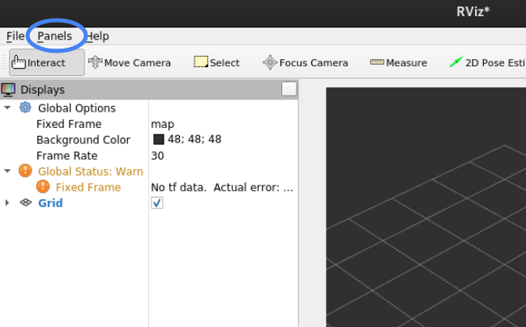
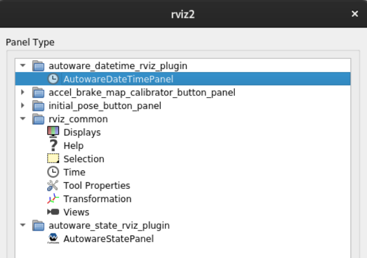

# autoware_datetime_rviz_plugin

## Purpose
This plugin displays the ROS Time and Wall Time in rviz.

## HowToUse
1. Start rviz and select panels/Add new panel.  

2. Then, select autoware_datetime_rviz_plugin/AutowareDateTimePanel and press OK.

