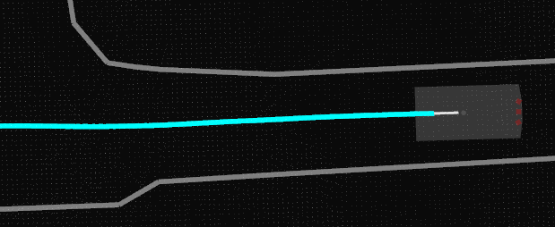

Autoware Localization Rviz Plugin
=============================================

## Purpose
This plugin can display the history of the localization obtained by ekf_localizer or ndt_scan_matching.

## Inputs / Outputs

### Input

| Name                              | Type                                                  | Description                                       |
| --------------------------------- | ----------------------------------------------------- | ------------------------------------------------- |
| `input/pose` | `geometry_msgs::msg::PoseStamped`             | In input/pose, put the result of localization calculated by ekf_localizer or ndt_scan_matching. |

## Example

