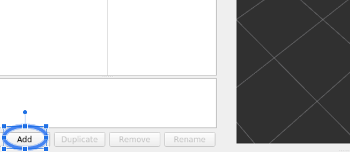
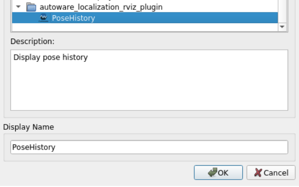
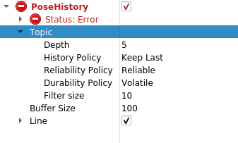

# autoware_lacalization_rviz_plugin
## Purpose
This plugin can display the history of the localization obtained by ekf_localizer or ndt_scan_matching.

## Inputs / Outputs

### Input

| Name                              | Type                                                  | Description                                       |
| --------------------------------- | ----------------------------------------------------- | ------------------------------------------------- |
| `input/pose` | `geometry_msgs::msg::PoseStamped`             | In input/pose, put the result of localization calculated by ekf_localizer or ndt_scan_matching |

## Parameters

### Node Parameters
| Name          | Type   | Default Value | Description                 |
| ------------- | ------ | ------------- | --------------------------- |
| `Buffer Size` | int | 100          | Buffer size of topic |
| `Line` | bool | true          | Use Line property or not |
| `Width` | float | 0.1          | Width of Line property [m] |
| `Alpha` | float | 1.0          | Alpha of Line property |
| `Color` | QColor | Qt::white          | Color of Line property |

## Assumptions / Known limits
Using a planning simulator

## HowToUse
1. Start rviz and select Add under the Displays panel.  

2. Then, select autoware_localization_rviz_plugin/PoseHistory and press OK.

3. Enter the name of the topic where you want to view the trajectory.  

4. Use the planning simulator or the logging simulator to see the trajectory of the vehicle position when you engage the vehicle.
