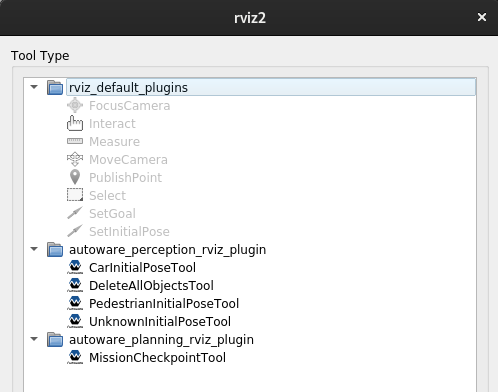

# autoware_perception_rviz_plugin

## Purpose
This plugin is used to generate dummy pedestrians, cars, and obstacles in planning simulator.

## Overview
The CarInitialPoseTool simulates a dummy car.  
The PedestrianInitialPoseTool simulates a dummy pedestrian.  
The UnknownInitialPoseTool simulates a dummy obstacle.  
The DeleteAllObjectsTool deletes the dummy cars, pedestrians, and obstacles displayed by the above three tools.  
## Inputs / Outputs
### Output
| Name                              | Type                                                  | Description                                       |
| --------------------------------- | ----------------------------------------------------- | ------------------------------------------------- |
| `/simulation/dummy_perception_publisher/object_info` | `dummy_perception_publisher::msg::Object`             | The topic on which to publish dummy object info |
## Parameter
### Node Parameters
| Name          | Type   | Default Value | Description                 |
| ------------- | ------ | ------------- | --------------------------- |
| `X std deviation` | float | 0.03          | X standard deviation for initial pose [m] |
| `Y std deviation` | float | 0.03          | Y standard deviation for initial pose [m] |
| `Z std deviation` | float | 0.03          | Z standard deviation for initial pose [m] |
| `Theta std deviation` | float | 5.0 * M_PI / 180.0          | Theta standard deviation for initial pose [rad] |
| `Z_position` | float | 0.0          | Z position for initial pose [m] |
| `Velocity` | float | 0.0          | velocity [m/s] |

## Assumptions / Known limits
Using a planning simulator

## HowToUse
1. Start rviz and select + on the tool tab.

2. Select one of the following: autoware_perception_rviz_plugin and press OK.

3. Select the new item in the tool tab (2D Dummy Car in the example) and click on it in rviz.

