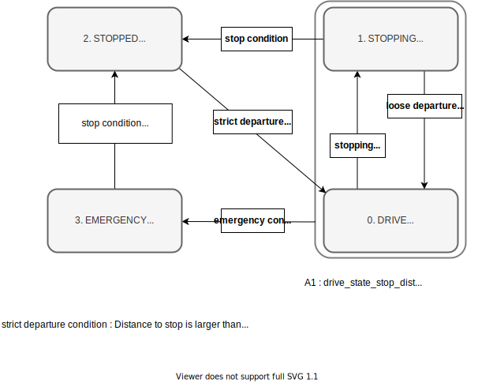

# Velocity Controller
===========

# Purpose / Use cases

The velocity_controller computes the target acceleration from the ego-velocity to realize the target velocity set at each point on the target trajectory using a feed-forward/back control.

It also contains a slope force correction that takes into account road slope information, and a delay compensation function.
It is assumed that the target acceleration calculated here will be properly realized by the vehicle interface.

Note that the use of this module is not mandatory for Autoware if the vehicle supports the "target speed" interface.

#### why separate lateral (steering) and longitudinal (velocity) control?

This velocity controller assumes that the roles of lateral and longitudinal control are separated as follows.

 - Lateral control computes a target steering to keep the vehicle on the trajectory, assuming perfect velocity tracking.
 - Longitudinal control computes a target velocity/acceleration to keep the vehicle velocity on the trajectory speed, assuming perfect trajectory tracking.

Ideally, dealing with the lateral and longitudinal control as a single mixed problem can achieve high performance. In contrast, there are two reasons to provide velocity controller as a stand-alone function, described below.

##### Complex requirements for longitudinal motion

The longitudinal vehicle behavior that humans expect is difficult to express in a single logic. For example, the expected behavior just before stopping differs depending on whether the ego-position is ahead/behind of the stop line, or whether the current speed is higher/lower than the target speed to achieve a human-like movement.

In addition, some vehicles have difficulty measuring the ego-speed at extremely low speeds. In such cases, a configuration that can improve the functionality of the longitudinal control without affecting the lateral control is important.

There are many characteristics and needs that are unique to longitudinal control. Designing them separately from the lateral control keeps the modules less coupled and improves maintainability.

##### Nonlinear coupling of lateral and longitudinal motion

The lat-lon mixed control problem is very complex and uses nonlinear optimization to achieve high performance. Since it is difficult to guarantee the convergence of the nonlinear optimization, a simple control logic is also necessary for development.

Also, the benefits of simultaneous longitudinal and lateral control are small if the vehicle doesn't move at high speed.

##### So, how should we consider lateral and longitudinal motion simultaneously?

On the other hand, in the following cases, lateral and longitudinal movements should be considered and designed at the same time.

 - the vehicle should decelerate when it is approaching a curve
 - the vehicle should drive at low speed when it deviates from the path.

 However, since these can be done without using the internal information of the controller modules, it is assumed that these functions are properly designed in the previous path/velocity planning modules.
 The control module is only meant to follow the planned trajectory as accurately as possible, and this module itself will not override the desired motion.

# Design

## Assumptions / Known limits

1. Smoothed target velocity and its acceleration shall be set in the trajectory
   1. The velocity command is not smoothed inside the controller (only noise may be removed).
   2. For step-like target signal, tracking is performed as fast as possible.
2. The vehicle velocity must be an appropriate value
   1. The ego-velocity must be a signed-value corresponding to the forward/backward direction
   2. The ego-velocity should be given with appropriate noise processing.
   3. If there is a large amount of noise in the ego-velocity, the tracking performance will be significantly reduced.
3. The output of this controller must be achieved by later modules (e.g. vehicle interface).
   1. If the vehicle interface does not have the target velocity or acceleration interface (e.g., the vehicle only has a gas pedal and brake interface), an appropriate conversion must be done after this controller.

## Inputs / Outputs / API

#### output
 * control_cmd [`autoware_control_msgs/ControlCommandStamped`] : command to control the vehicle for the longitudinal motion. It contains the target velocity and target acceleration.
 * debug_values [`std_msgs/Float32MultiArray`] : debug values used for the control command generation (e.g. the contributions of each P-I-D terms).

#### input
 * current_velocity [`geometry_msgs/TwistStamped`] : Current ego-velocity. `/localization/twist` is currently used in the Autoware.iv.
 * current_trajectory [`autoware_planning_msgs/Trajectory`] : Current target trajectory for the desired velocity on the each trajectory points.
 * /tf [`tf2_msgs/TFMessage`] : For ego-pose.

#### Note: why the debug message uses the multi-array?

Ideally, this message should be defined as a specific debug message with meaningful field names, like `VelocityControllerDebugValues.msg`. However, these debug values are fluid and new items are frequently added on the development phase, and unfortunately, adding a new field to a ros message definition is not backward compatible. Whereas, new elements can be added in the array-type message without any burden. This is why the `Float32MultiArray` type is currently used for now. The content of each element is defined in the header file.

## Inner-workings / Algorithms

### States

This module has four state transitions as shown below in order to handle special processing in a specific situation.

 - **DRIVE**
   - Executes target velocity tracking by PID control.
   - It also applies the delay compensation and slope compensation.
 - **STOPPING**
   - Controls the motion just before stopping.
   - Special sequence is performed to achieve accurate and smooth stopping.
 - **STOPPED**
   - Performs operations in the stopped state (e.g. brake hold)
 - **EMERGENCY**.
   - Enters an emergency state when certain conditions are met (e.g., when the vehicle has crossed a certain distance of a stop line).
   - The recovery condition (whether or not to keep emergency state until the vehicle completely stops) or the deceleration in the emergency state are defined by parameters.

The state transition diagram is shown below.

### Logics

#### Control Block Diagram

#### FeedForward (FF)

The reference acceleration set in the trajectory and slope compensation terms are output as a feedforward. Under ideal conditions with no modeling error, this FF term alone should be sufficient for velocity tracking.

Tracking errors causing modeling or discretization errors are removed by the feedback control (now using PID).

#### Slope compensation

Based on the slope information, a compensation term is added to the target acceleration.

There are two sources of the slope information, which can be switched by a parameter.
 - Pitch of the estimated ego-pose (default)
   - Calculates the current slope from the pitch angle of the estimated ego-pose
   - Pros: Easily available
   - Cons: Cannot extract accurate slope information due to the influence of vehicle vibration.
 - Z coordinate on the trajectory
   - Calculates the road slope from the difference of z-coordinates between the front and rear wheel positions in the target trajectory
   - Pros: More accurate than pitch information, if the z-coordinates of the route are properly maintained
   - Pros: Can be used in combination with delay compensation (not yet implemented)
   - Cons: z-coordinates of high-precision map is needed.
   - Cons: Does not support free space planning (for now)

#### PID control

For deviations that cannot be handled by FeedForward control, such as model errors, PID control is used to construct a feedback system.

This PID control calculates the target acceleration from the deviation between the current ego-velocity and the target velocity.

This PID logic has a maximum value for the output of each term. This is to prevent the following:
 - Large integral terms may cause unintended behavior by users.
 - Unintended noise may cause the output of the derivative term to be very large.

Also, the integral term is not accumulated when the vehicle is stopped. This is to prevent unintended accumulation of the integral term in cases such as "Autoware assumes that the vehicle is engaged, but an external system has locked the vehicle to start.
On the other hand, if the vehicle gets stuck in a depression in the road surface when starting, the vehicle will not start forever, which is currently being addressed by developers.

At present, PID control is implemented from the viewpoint of trade-off between development/maintenance cost and performance.
This may be replaced by a higher performance controller (adaptive control or robust control) in future development.

#### Time delay compensation

At high speeds, the delay of actuator systems such as gas pedals and brakes has a significant impact on driving accuracy.
Depending on the actuating principle of the vehicle, the mechanism that physically controls the gas pedal and brake typically has a delay of about a hundred millisecond.

In this controller, the predicted ego-velocity and the target velocity after the delay time are calculated and used for the feedback to address the time delay problem.

# References / External links

 -

# Future extensions / Unimplemented parts

 -

# Related issues

 -
