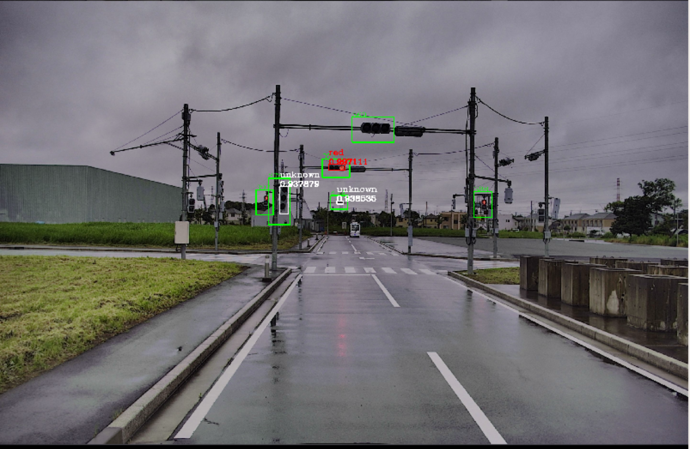

# traffic_light_visualization

## Purpose

The `traffic_light_visualization` is a package that includes two visualizing nodes:

- **traffic_light_map_visualizer** is a node that shows traffic lights color status and position on rviz as markers.
- **traffic_light_roi_visualizer** is a node that draws the result of traffic light recognition nodes (traffic light status, position and classification probability) on the input image as shown in the following figure and publishes it.

## Inner-workings / Algorithms

## Inputs / Outputs

### traffic_light_map_visualizer

#### Input

| Name                 | Type                                                     | Description              |
| -------------------- | -------------------------------------------------------- | ------------------------ |
| `~/input/tl_state`   | `autoware_auto_perception_msgs::msg::TrafficSignalArray` | status of traffic lights |
| `~/input/vector_map` | `autoware_auto_mapping_msgs::msg::HADMapBin`             | vector map               |

#### Output

| Name                     | Type                                   | Description                                          |
| ------------------------ | -------------------------------------- | ---------------------------------------------------- |
| `~/output/traffic_light` | `visualization_msgs::msg::MarkerArray` | marker array that indicates status of traffic lights |

### traffic_light_roi_visualizer

#### Input

| Name                          | Type                                                       | Description              |
| ----------------------------- | ---------------------------------------------------------- | ------------------------ |
| `~/input/tl_state`            | `autoware_auto_perception_msgs::msg::TrafficSignalArray`   | status of traffic lights |
| `~/input/image`               | `sensor_msgs::msg::Image`                                  | input image              |
| `~/input/rois`                | `autoware_auto_perception_msgs::msg::TrafficLightRoiArray` | input rois               |
| `~/input/rough/rois` (option) | `autoware_auto_perception_msgs::msg::TrafficLightRoiArray` | input rois               |

#### Output

| Name             | Type                      | Description            |
| ---------------- | ------------------------- | ---------------------- |
| `~/output/image` | `sensor_msgs::msg::Image` | output image with rois |

## Parameters

### traffic_light_map_visualizer

None

### traffic_light_roi_visualizer

#### Node Parameters

| Name                    | Type | Default Value | Description                   |
| ----------------------- | ---- | ------------- | ----------------------------- |
| `enable_fine_detection` | bool | false         | whether to use fine detection |

See detail algorithm about the fine detection in [1].

## Assumptions / Known limits

## (Optional) Error detection and handling

## (Optional) Performance characterization

## (Optional) References/External links

[1] M. Sandler, A. Howard, M. Zhu, A. Zhmoginov and L. Chen, "MobileNetV2: Inverted Residuals and Linear Bottlenecks," 2018 IEEE/CVF Conference on Computer Vision and Pattern Recognition, Salt Lake City, UT, 2018, pp. 4510-4520, doi: 10.1109/CVPR.2018.00474.

## (Optional) Future extensions / Unimplemented parts
