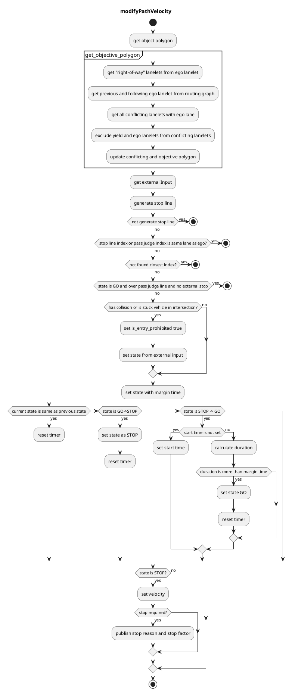

### intersection

#### Role

Judgement whether a vehicle can go into an intersection or not by a dynamic object information, and planning a velocity of the low-down/stop
This module is designed for rule-based intersection velocity decision that is easy for developers to design its behavior. It generates proper velocity for intersection scene.

In addition, the approval interface of behavior_velocity_planner allows external users / modules (e.g. remote operation) to intervene the decision of the vehicle behavior.　 This function is expected to be used, for example, for remote intervention in emergency situations or gathering information on operator decisions during development.

### Limitations

This module allows developers to design vehicle velocity in intersection module using specific rules. Due to the property of rule-based planning, the algorithm is greatly depends on object detection and prediction accuracy considering as stuck vehicle in this intersection module. Also, this module only handles "safe velocity" at the intersection, so rushing or quick decision according to traffic condition is future work.

#### Launch Timing

Launches when there is a conflicting lanelet in ego lane.

#### How to Decide Intersection Stop

The intersection stop target should be limited to stuck vehicle in the middle of the road or incoming cruising vehicle that will collide with ego vehicle. Therefore, target vehicles for considering intersection stop meet the following specific conditions.

- It is inside detection area polygon created in this module and is stopped(parametrized)
  - This means that moving object inside ego lane is not considered as stop target.
- It is a specific class.
  - User can change intersection stop targets (e.g. do not stop unknown-class targets).
- It will collide with ego vehicle.
  - This means that the other incoming vehicle from conflicting lanelet can collide with ego vehicle.

#### Module Parameters

| Parameter                                     | Type   | Description                                                                   |
| --------------------------------------------- | ------ | ----------------------------------------------------------------------------- |
| `intersection/state_transit_margin_time`      | double | [m] time margin to change state                                               |
| `intersection/decel_velocity`                 | double | [m] deceleration velocity in intersection                                     |
| `intersection/path_expand_width`              | bool   | [m] path area to see with expansion                                           |
| `intersection/stop_line_margin`               | double | [m] margin before stop line                                                   |
| `intersection/stuck_vehicle_detect_dist`      | double | [m] this should be the length between cars when they are stopped.             |
| `intersection/stuck_vehicle_ignore_dist`      | double | [m] obstacle stop max distance(5.0m) + stuck vehicle size / 2 (0.0m-)         |
| `intersection/stuck_vehicle_vel_thr`          | double | [m/s] velocity below 3[km/h] is ignored by default                            |
| `intersection/intersection_velocity`          | double | [m/s] velocity to pass intersection. 10[km/h] is by default                   |
| `intersection/intersection_max_accel`         | double | [m/s^2] acceleration in intersection                                          |
| `intersection/detection_area_margin`          | double | [m] range for expanding detection area                                        |
| `intersection/detection_area_length`          | double | [m] range for lidar detection 200m is by default                              |
| `intersection/detection_area_angle_threshold` | double | [rad] threshold of angle difference between the detection object and lane     |
| `intersection/min_predicted_path_confidence`  | double | [-] minimum confidence value of predicted path to use for collision detection |
| `merge_from_private_road/stop_duration_sec`   | double | [s] duration to stop                                                          |

#### Usage And Parameter Tuning

 Incase

- The time to change state form `Stop` to `GO` is  too long.
  - Change `state_transit_margin_time` to lower value. Be careful if this margin is too small then vehicle is going to change state many times and cause chattering. 
- The distance to stuck vehicle is too long.
  - Change `stuck_vehicle_detect_dist` to lower value. Note this module consider obstacle stop max distance as detection distance.
-  The speed in intersection is too slow
  - Change `intersection_velocity` to higher value.

#### Flowchart

NOTE current state is treated as `STOP` if `is_entry_prohibited` = `true` else `GO`

##### Known Limits

- Currently intersection module creates detection area polygon by interpolation of ego path point with an interval of 1m so if ego path point is changing little by little, it can have chattering at the corner of detection area polygon.
- This module generate intersection stop line and ignoring lanelet automatically form lanelet map , however if you want to set intersection stop line and ignoring lanelet manually you need to tag `right_of_way` and `yield` to all conflicting lanes properly.

