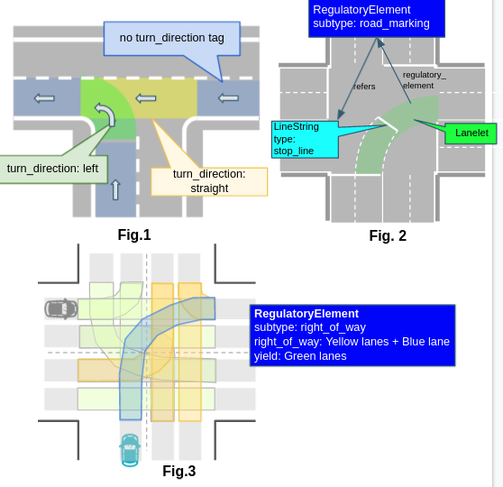
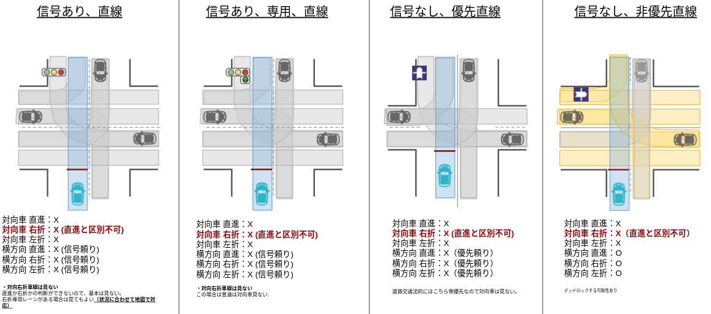
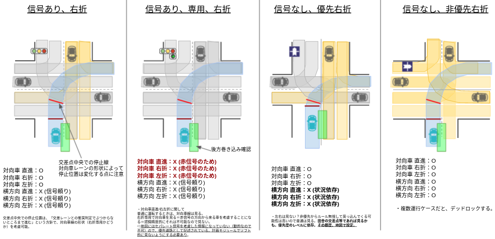
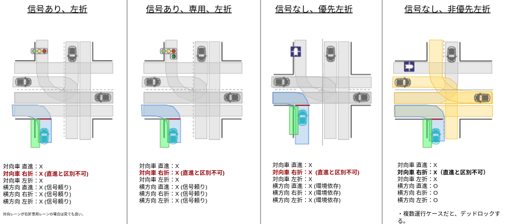
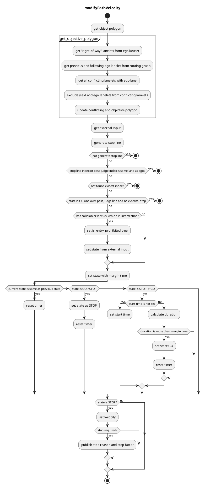

## Intersection

### Role

Judgement whether a vehicle can go into an intersection or not by a dynamic object information, and planning a velocity of the low-down/stop.
This module is designed for rule-based intersection velocity decision that is easy for developers to design its behavior. It generates proper velocity for intersection scene.

In addition, the external users / modules (e.g. remote operation) to can intervene the STOP/GO decision for the vehicle behavior. The override interface is expected to be used, for example, for remote intervention in emergency situations or gathering information on operator decisions during development.

### Launch Timing

Launches when there is a conflicting lanelet in ego lane.

### Limitations

This module allows developers to design vehicle velocity in intersection module using specific rules. This module is affected by object detection and prediction accuracy considering as stuck vehicle in this intersection module.

### Inner-workings / Algorithms

#### Attention Target Objects

Car, truck, bus, motorbike are included in the attention target object for the velocity planning in the intersection and bicycle, pedestrian, animal, unknown are not.

#### Attention Lane

The lane crossing with driving lane and has high priority for the driving lane is defined as attention lane. (Priority tags are needed to be configured according to the situation.)

#### Crossing Judgement

Time to pass the intersection will be calculated with the length of the intersection (Supposed constant velocity : 10km/h). Driving lane polygon is defined from the position of the ego vehicle to the end point of the lane with intersection tag. It is checked if the polygon and the predicted path of the attention target objects will be crossed.

#### State Transition (go / stop)

If there is no crossing more than a certain period (default : 2.0[s]), the state transits to “go”. If crossing is detected even once, the state transits to “stop”.

#### Stop Line Automatic Generation

The driving lane is complemented at a certain intervals (default : 20 [cm]), and the line which is a margin distance (default : 100cm) in front of the attention lane is defined as a stop line. (Also the length of the vehicle is considered and the stop point is set at the base_link point in front of the stop lane.)

#### Pass Judge Line

To avoid a rapid braking, in case that a deceleration more than a threshold (default : 0.5[G]) is needed, the ego vehicle doesn’t stop. In order to judge this condition, pass judge line is set a certain distance (default : 0.5 \* v_current^2 / a_max) in front of the stop line.
To prevent a chattering, once the ego vehicle passes this line, “stop” decision in the intersection won’t be done any more.
To prevent going over the pass judge line before the traffic light stop line, the distance between stop line and pass judge line become 0m in case that there is a stop line between the ego vehicle and an intersection stop line.

#### Vehicle In a Same Lane Removal

Ignore the object in front of/ behind the ego vehicle in the same lane (Improvement needed : the linkage with the uuid in tracking is needed)

#### Stuck vehicle

If there is any object in a certain distance (default : 5[m]) from the end point of the intersection lane on the driving lane and the object velocity is less than a threshold (default 3.0[km/h]), the object is regarded as a stuck vehicle. If the stuck vehicle exists, the ego vehicle cannot enter the intersection.

### How to Decide Intersection Stop

The intersection stop target should be limited to stuck vehicle in the middle of the road or incoming cruising vehicle that will collide with ego vehicle. Therefore, target vehicles for considering intersection stop meet the following specific conditions.

- It is inside detection area polygon created in this module and is stopped(parametrized)
  - This means that moving object inside ego lane is not considered as stop target.
- It is a specific class.
  - User can change intersection stop targets (e.g. do not stop unknown-class targets).
- It will collide with ego vehicle.
  - This means that the other incoming vehicle from conflicting lanelet can collide with ego vehicle.

### Mandatory information and point of attention

#### set a turn_direction tag (Fig. 1)

IntersectionModule will be launched by this tag. If this tag is not set, ego-vehicle don’t recognize the lane as an intersection. Even if it’s a straight lane, this tag is mandatory if it is located within intersection.
Set a value in turn_direction tag to light up turn signals
Values of turn_direction must be one of “straight”(no turn signal), “right” or “left”. Autoware will light up respective turn signals 30[m] before entering the specified lane. You may also set optional tag “turn_signal_distance” to modify the distance to start lighting up turn signals.
Lanes within intersections must be defined as a single Lanelet
For example, blue lane in Fig.3 cannot be split into 2 Lanelets

#### Optional information Explicitly describe a stop position [RoadMarking] (Fig. 2)

As a default, IntersectionModule estimates a stop position by the crossing point of driving lane and attention lane. But there are some cases like Fig.2 in which we would like to set a stop position explicitly. When a stop_line is defined as a RoadMarking item in the intersection lane, it overwrites the stop position. (Not only creating stop_line, but also defining as a RoadMaking item are needed.)

#### Exclusion setting of attention lanes [RightOfWay] (Fig.3)

By default, IntersectionModule treats all lanes crossing with the registered lane as attention targets (yellow and green lanelets). But in some cases (eg. when driving lane is priority lane or traffic light is green for the driving lane), we want to ignore some of the yield lanes. By setting RightOfWay of the RegulatoryElement item, we can define lanes to be ignored. Register ignored lanes as “yield” and register the attention lanes and driving lane as “right_of_way” lanelets in RightOfWay RegulatoryElement (For an intersection with traffic lights, we need to create items for each lane in the intersection. Please note that it needs a lot of man-hours.)

### Attention Area

1. 障害物が Detection area 内にいるかどうかの判定は障害物の中心座標が Detection area から一定以内にいるかどうかで判定している。基本的には”障害物の中心座標が Detection area にいるときのみ対象として検知”でよいが、非対象レーンから対象レーンにレーンチェンジして来る障害物などは、対象として検知したい。全長 4.5m の車が、経路に対して 10 度程度で対象レーンに車線変更してきたとき、車両先頭がレーンに侵入してきた瞬間の車両中心位置の対象レーンからの距離は 39cm となる。これにややマージンをもたせ、Detection area から 50cm 以内を検知の対象とした。

2. 障害物が Detection area 内にいる場合その障害物の姿勢をレーン姿勢とし、逆走している車両などは無視する。
3. Detection area 内にはいっている物体の Predicted path を見るとき、confidence が一定以下のものは無視する。現状の confidence は、中央線までの横距離を d として、1/d に比例する。また、全ての predicted path の confidence の総和は 1 となっている。
   predicted path の個数は、車線変更可能なレーンがあるかどうか、また各レーンがその先でいくつに分岐しているかに依存する。Path の個数によっても confidence の個数は変わるため、絶対値がそれほど意味を持たないことには注意したい。このモジュールでは、まったくレーンチェンジしてくる素振りのない障害物のレーンチェンジパスなど、無意味なものだけを無視し、他は全て考慮しておきたい。そのため、以下の様な目安で 0.05 とした。全長 1.7m 程度の車が車線変更してくるとする。この際、車の中心位置と道路境界の間の距離が 65cm 程度のところまで近づいてきた場合に 0.05 となる。つまり、”障害物と Detection area の距離”というパラメタに換算すると 65cm となり、1.よりも緩めのパラメタとなる（つまり、妥当な predicted_path が confidence によって無視されてしまう可能性は極めて低い。）
4. 交差点モジュールで Detection area を生成する際に、経路がループしているような状況ではエゴレーンの後ろの経路は Detection area に含めない。
5. Detection area 内にいる検知対象の自車と障害物の予測軌道をもとに衝突判定を行い、衝突しない場合は障害物が Detection area 内にいても intersection もジュールによる停止はかけない。

### Module Parameters

| Parameter                                     | Type   | Description                                                                   |
| --------------------------------------------- | ------ | ----------------------------------------------------------------------------- |
| `intersection/state_transit_margin_time`      | double | [m] time margin to change state                                               |
| `intersection/decel_velocity`                 | double | [m] deceleration velocity in intersection                                     |
| `intersection/path_expand_width`              | bool   | [m] path area to see with expansion                                           |
| `intersection/stop_line_margin`               | double | [m] margin before stop line                                                   |
| `intersection/stuck_vehicle_detect_dist`      | double | [m] this should be the length between cars when they are stopped.             |
| `intersection/stuck_vehicle_ignore_dist`      | double | [m] obstacle stop max distance(5.0[m]) + stuck vehicle size / 2.0[m])         |
| `intersection/stuck_vehicle_vel_thr`          | double | [m/s] velocity below 3[km/h] is ignored by default                            |
| `intersection/intersection_velocity`          | double | [m/s] velocity to pass intersection. 10[km/h] is by default                   |
| `intersection/intersection_max_accel`         | double | [m/s^2] acceleration in intersection                                          |
| `intersection/detection_area_margin`          | double | [m] range for expanding detection area                                        |
| `intersection/detection_area_length`          | double | [m] range for lidar detection 200[m] is by default                            |
| `intersection/detection_area_angle_threshold` | double | [rad] threshold of angle difference between the detection object and lane     |
| `intersection/min_predicted_path_confidence`  | double | [-] minimum confidence value of predicted path to use for collision detection |
| `merge_from_private_road/stop_duration_sec`   | double | [s] duration to stop                                                          |

### How To Tune Parameters

- The time to change state form `Stop` to `GO` is too long.
  - Change `state_transit_margin_time` to lower value. Be careful if this margin is too small then vehicle is going to change state many times and cause chattering.
- The distance to stuck vehicle is too long.
  - Change `stuck_vehicle_detect_dist` to lower value. Note this module consider obstacle stop max distance as detection distance.
- The speed in intersection is too slow
- Change `intersection_velocity` to higher value.

### Flowchart

NOTE current state is treated as `STOP` if `is_entry_prohibited` = `true` else `GO`

### Known Limits

- This module generate intersection stop line and ignoring lanelet automatically form lanelet map , however if you want to set intersection stop line and ignoring lanelet manually you need to tag `right_of_way` and `yield` to all conflicting lanes properly.
