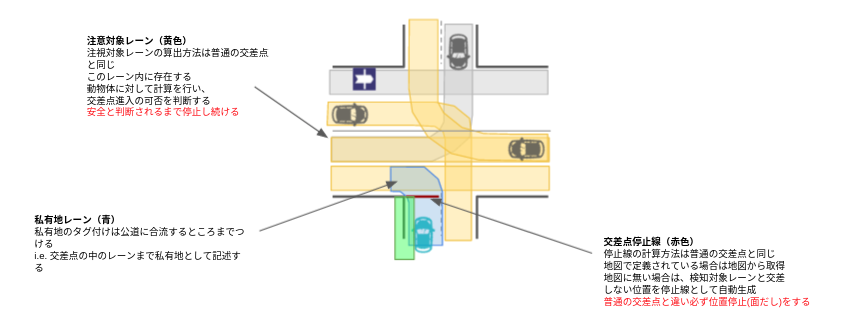

## Merge From Private

### Role

私有地（例えば駐車場）から公道へ出る際には面出しする必要がある. もし交差点のレーンに私有地タグ(location = private)がついていて、次のレーンが私有地ではない場合は必ず一時停止をして交差点に侵入する. 停止位置の算出方法は交差点モジュールと同じで、注視領域も同じ
i.e. 必ず一時停止を行う以外は交差点モジュールと同じ機能になる.

### Activation Timing

This module is activated when the following conditions are met:

- ego-lane has a `private` tag
- ego-lane has a conflict with other no-private lanelets

### Module Parameters

| Parameter                                   | Type   | Description                     |
| ------------------------------------------- | ------ | ------------------------------- |
| `merge_from_private_road/stop_duration_sec` | double | [m] time margin to change state |

### Known Issue

If ego vehicle go over the stop line for a certain distance, then ego vehicle will not transit from STOP.
