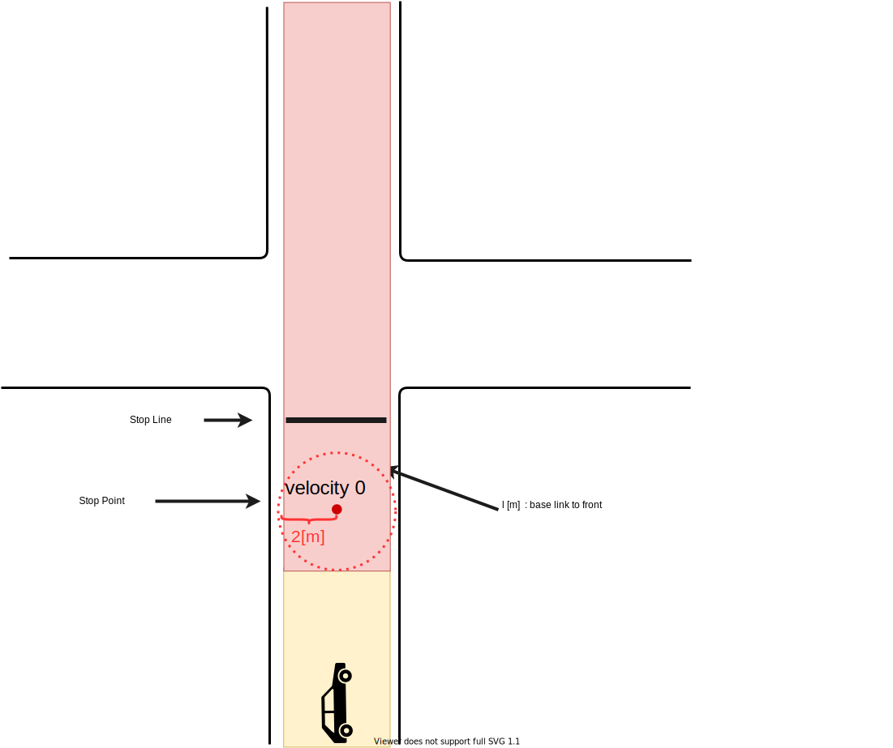

## Stop Line

#### Role

This module plans velocity so that the vehicle can stop right before stop lines and restart driving after stopped.

### Launch Timing

Launches when there is a stop line in a target lane.

### Inner-workings / Algorithms

- Obtains a stop line from map information.
- Generates a stop point on the path before the stop line. The distance between the stop point and the stop line is the same length from base_link to the front bumper.
- Rewrites velocities of the pass after the stop point with 0[m/s].
- Finishes when the vehicle stopped within a radius of 2[m] from the stop point.

#### Module Parameters

| Parameter         | Type   | Description                                                                                    |
| ----------------- | ------ | ---------------------------------------------------------------------------------------------- |
| `stop_margin`     | double | a margin that the vehicle tries to stop before stop_line                                       |
| `stop_check_dist` | double | when the vehicle is within `stop_check_dist` from stop_line and stopped, move to STOPPED state |

#### Flowchart

```plantuml
@startuml
title modifyPathVelocity
start

:find collision between path and stop_line;

if (collision is found?) then (yes)
else (no)
  stop
endif

:find offset segment;

:calculate stop pose;

:calculate distance to stop line;

if (state is APPROACH) then (yes)
  :set stop velocity;

  if (vehicle is within stop_check_dist?) then (yes)
    if (vehicle is stopped?) then (yes)
      :change state to STOPPED;
    endif
  endif
else if (state is STOPPED) then (yes)
  if (vehicle started to move?) then (yes)
    :change state to START;
  endif
else if (state is START) then (yes)
  if ([optional] far from stop line?) then (yes)
    :change state to APPROACH;
  endif
endif

stop
@enduml
```

This algorithm is based on `segment`.
`segment` consists of two node points. It's useful for removing boundary conditions because if `segment(i)` exists we can assume `node(i)` and `node(i+1)` exist.

First, this algorithm finds a collision between reference path and stop line.
Then, we can get `collision segment` and `collision point`.

Next, based on `collision point`, it finds `offset segment` by iterating backward points up to a specific offset length.
The offset length is `stop_margin`(parameter) + `base_link to front`(to adjust head pose to stop line).
Then, we can get `offset segment` and `offset from segment start`.

After that, we can calculate a offset point from `offset segment` and `offset`. This will be `stop_pose`.

