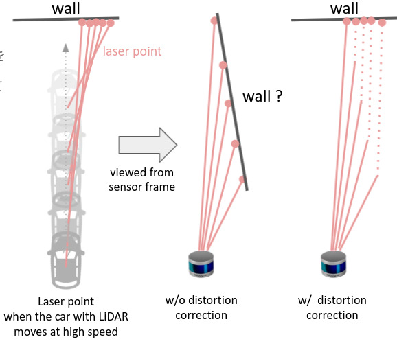

# distortion_corrector

## Purpose

The `distortion_corrector` is a node that compensates pointcloud distortion caused by ego vehicle's movement during 1 scan.

Since the LiDAR sensor scans by rotating an internal laser, the resulting point cloud will be distorted if the ego-vehicle moves during a single scan (as shown by the figure below). The node corrects this by interpolating sensor data using odometry of ego-vehicle.

## Inner-workings / Algorithms

- Use the qeuations below (specific to the Velodyne 32C sensor) to obtain an accurate timestamp for each scan data point.
- Use twist information to determine the distance the ego-vehicle has travelled between the time that the scan started and the corrected timestamp of each point, and then correct the position of the point.

The offset qeuation is given by
$ TimeOffset = (55.296 \mu s _SequenceIndex) + (2.304 \mu s_ DataPointIndex) $

To valculate the exact point time, add the TimeOffset to the timestamp.
$ ExactPointTime = TimeStamp + TimeOffset $

## Inputs / Outputs

### Input

| Name                      | Type                                              | Description      |
| ------------------------- | ------------------------------------------------- | ---------------- |
| `~/input/points`          | `sensor_msgs::msg::PointCloud2`                   | reference points |
| `~/input/velocity_report` | `autoware_auto_vehicle_msgs::msg::VelocityReport` | vehicle velocity |

### Output

| Name              | Type                            | Description     |
| ----------------- | ------------------------------- | --------------- |
| `~/output/points` | `sensor_msgs::msg::PointCloud2` | filtered points |

## Parameters

### Core Parameters

| Name                   | Type   | Default Value | Description           |
| ---------------------- | ------ | ------------- | --------------------- |
| `timestamp_field_name` | string | "time_stamp"  | time stamp field name |

## Assumptions / Known limits
