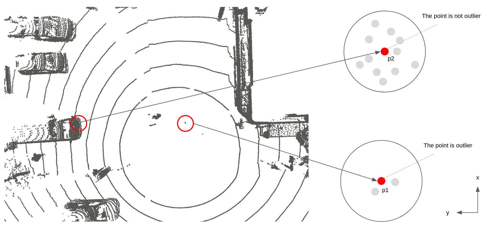

# radius_search_2d_outlier_filter

## Purpose

TODO

## Inner-workings / Algorithms

TODO

## Inputs / Outputs

### Input

| Name                 | Type                      | Description                               |
| -------------------- | ------------------------- | ----------------------------------------- |
| `~/input/pointcloud` | `sensor_msgs/PointCloud2` | Obstacle point cloud with ground removed. |

### Output

| Name                  | Type                      | Description                                  |
| --------------------- | ------------------------- | -------------------------------------------- |
| `~/output/pointcloud` | `sensor_msgs/PointCloud2` | Point cloud with outliers removed trajectory |

## Parameters

| Name            | Type   | Description                                                                                                              |
| --------------- | ------ | ------------------------------------------------------------------------------------------------------------------------ |
| `input_frame`   | string | The input topic frame id                                                                                                 |
| `output_frame`  | string | The output topic frame id                                                                                                |
| `min_neighbors` | int    | If points in the circle centered on reference point is less than `min_neighbors`, a reference point is judged as outlier |
| `search_radius` | double | Searching number of points included in `search_radius`                                                                   |

## Assumptions / Known limits

Since the method is to count the number of points contained in the cylinder with the direction of gravity as the direction of the cylinder axis, it is a prerequisite that the ground has been removed.

## (Optional) Error detection and handling

## (Optional) Performance characterization

## (Optional) References/External links

[1] <https://pcl.readthedocs.io/projects/tutorials/en/latest/remove_outliers.html>

## (Optional) Future extensions / Unimplemented parts
