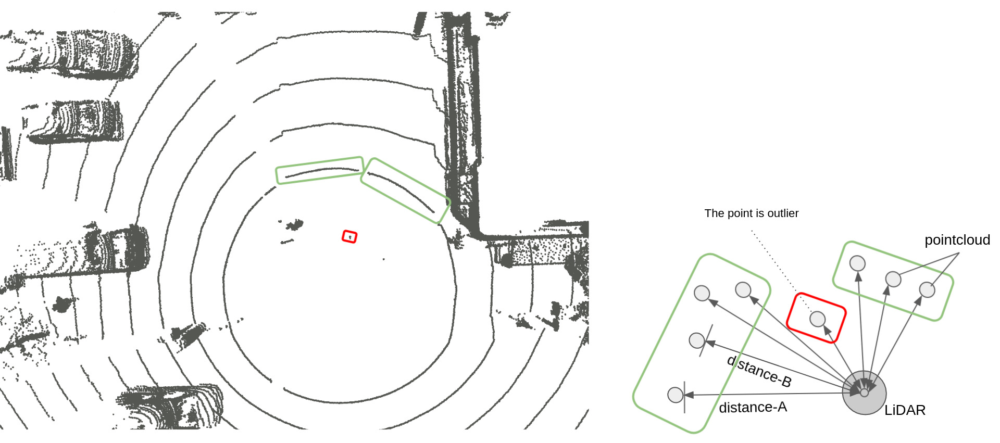

# ring_outlier_filter

## Purpose

TODO

## Inner-workings / Algorithms

TODO

## Inputs / Outputs

### Input

| Name                 | Type                      | Description                               |
| -------------------- | ------------------------- | ----------------------------------------- |
| `~/input/pointcloud` | `sensor_msgs/PointCloud2` | Obstacle point cloud with ground removed. |

### Output

| Name                  | Type                      | Description                                   |
| --------------------- | ------------------------- | --------------------------------------------- |
| `~/output/pointcloud` | `sensor_msgs/PointCloud2` | Point cloud with outliers removed. trajectory |

## Parameters

TODO

## Assumptions / Known limits

TODO

## (Optional) Error detection and handling

## (Optional) Performance characterization

## (Optional) References/External links

[1] <https://pcl.readthedocs.io/projects/tutorials/en/latest/remove_outliers.html>

## (Optional) Future extensions / Unimplemented parts
