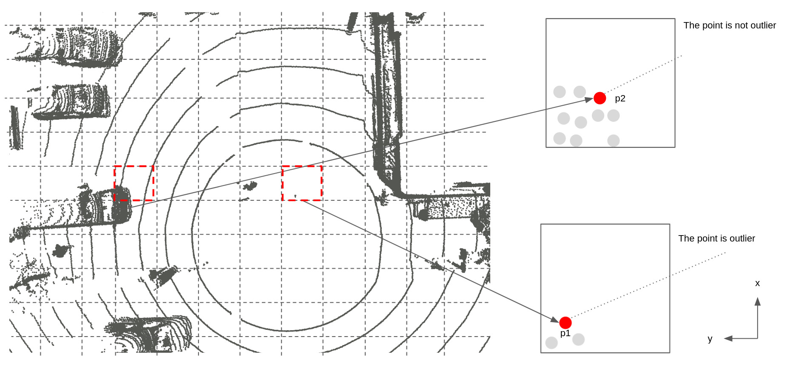

# voxel_grid_outlier_filter

## Purpose

TODO

## Inner-workings / Algorithms

TODO

## Inputs / Outputs

### Input

| Name                 | Type                      | Description                               |
| -------------------- | ------------------------- | ----------------------------------------- |
| `~/input/pointcloud` | `sensor_msgs/PointCloud2` | Obstacle point cloud with ground removed. |

### Output

| Name                  | Type                      | Description                                  |
| --------------------- | ------------------------- | -------------------------------------------- |
| `~/output/pointcloud` | `sensor_msgs/PointCloud2` | Point cloud with outliers removed trajectory |

## Parameters

| Name           | Type   | Description                  |
| -------------- | ------ | ---------------------------- |
| `input_frame`  | string | The input topic frame id     |
| `output_frame` | string | The output topic frame id    |
| `voxel_size_x` | string | The voxel size in the x-axis |
| `voxel_size_y` | string | The voxel size in the y-axis |
| `voxel_size_z` | string | The voxel size in the z-axis |

## Assumptions / Known limits

TODO

## (Optional) Error detection and handling

## (Optional) Performance characterization

## (Optional) References/External links

## (Optional) Future extensions / Unimplemented parts
